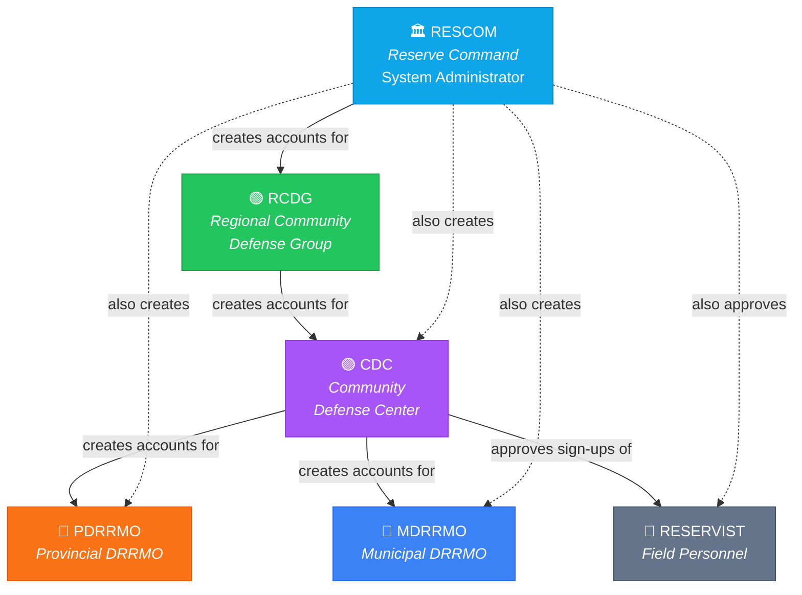
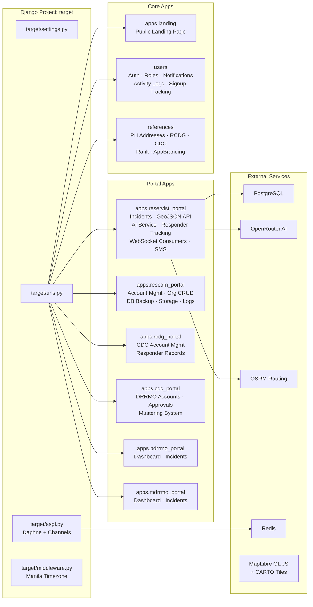
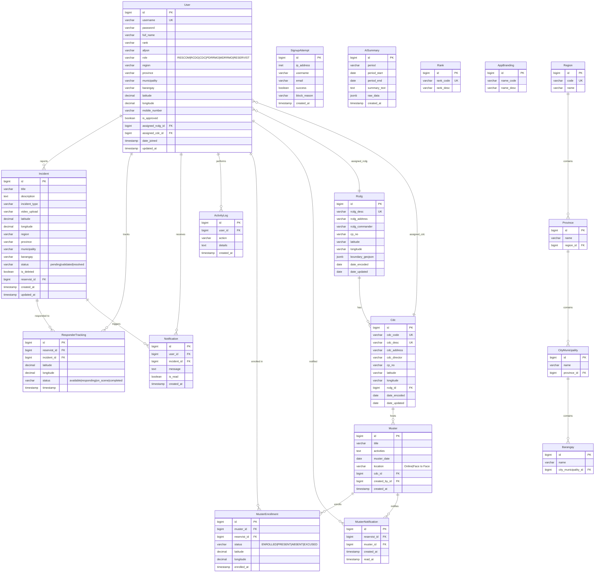

<p align="center">
  
</p>

<h1 align="center">Beyond Tactical Response Platform</h1>

<p align="center">
  <strong>Government-Grade Incident Management Powered by AI</strong><br/>
  Real-time coordination for Reserve Command Philippine Army, RCDGs, CDCs, and DRRMOs — all in one enterprise platform.
</p>

<p align="center">
  
  
  
  
  
  
  
  
</p>

<p align="center">
  
  
  
  
  
</p>

---

## Table of Contents

- [Overview](#overview)
- [Key Features](#key-features)
  - [Real-Time Operations](#-real-time-operations)
  - [AI-Powered Intelligence](#-ai-powered-intelligence)
  - [Interactive Mapping](#-interactive-mapping)
  - [Incident Management](#-incident-management)
  - [Mustering System](#-mustering-system)
  - [Security and Anti-Bot Protection](#-security-and-anti-bot-protection)
  - [Administration Tools](#-administration-tools)
- [System Architecture](#system-architecture)
  - [Organizational Hierarchy](#organizational-hierarchy)
  - [Application Structure](#application-structure)
  - [Technology Stack](#technology-stack)
- [Role-Based Access Control](#role-based-access-control)
- [Database Schema](#database-schema)
  - [Entity Relationship Diagram](#entity-relationship-diagram)
  - [Model Reference](#model-reference)
- [API Reference](#api-reference)
  - [REST Endpoints](#rest-endpoints)
  - [WebSocket Channels](#websocket-channels)
  - [AJAX Endpoints](#ajax-endpoints)
- [Project Structure](#project-structure)
- [Prerequisites](#prerequisites)
- [Installation and Setup](#installation-and-setup)
  - [1. Clone the Repository](#1-clone-the-repository)
  - [2. Create a Virtual Environment](#2-create-a-virtual-environment)
  - [3. Install Dependencies](#3-install-dependencies)
  - [4. Configure Environment Variables](#4-configure-environment-variables)
  - [5. Set Up PostgreSQL](#5-set-up-postgresql)
  - [6. Set Up Redis](#6-set-up-redis)
  - [7. Run Database Migrations](#7-run-database-migrations)
  - [8. Load Philippine Address Data](#8-load-philippine-address-data)
  - [9. Create the RESCOM Superuser](#9-create-the-rescom-superuser)
  - [10. Collect Static Files](#10-collect-static-files)
- [Running the Application](#running-the-application)
  - [Development Server](#development-server)
  - [Production Deployment](#production-deployment)
- [Environment Variables Reference](#environment-variables-reference)
- [Contributing](#contributing)
- [License](#license)
- [Acknowledgments](#acknowledgments)

---

## Overview

The **Beyond Tactical Response (BTR) Platform** is an enterprise-grade emergency incident management system purpose-built for the **Reserve Command of the Philippine Army**. It connects the full chain of command — from the Reserve Command (RESCOM) down to individual Reservists in the field — through a unified, real-time web platform.

BTR enables Reservists to report emergency incidents (floods, fires, earthquakes, typhoons, landslides, accidents) with GPS-tagged evidence. These reports instantly propagate through a WebSocket-driven notification system to all relevant command tiers, playing audible alarms on every connected dashboard. Command staff at RCDG, CDC, PDRRMO, and MDRRMO levels can monitor incidents on interactive maps, track live responder movement, update incident statuses, and generate AI-powered analytics summaries.

The platform implements a strict organizational hierarchy with scoped data access: each role sees only what it is authorized to see, and account creation flows downward through the chain of command. Reservists register publicly but require CDC approval before they can access the system.

**Who it serves:**

| Tier | Entity | Function |
|------|--------|----------|
| 1 | **RESCOM** (Reserve Command) | System administrator — oversees all RCDGs, manages all data, database backup/restore |
| 2 | **RCDG** (Regional Community Defense Group) | Regional command — manages CDCs under its jurisdiction |
| 3 | **CDC** (Community Defense Center) | Local command — manages DRRMOs, approves Reservists, creates mustering events |
| 4 | **PDRRMO** / **MDRRMO** | Provincial / Municipal Disaster Risk Reduction and Management Office — civilian counterparts |
| 5 | **RESERVIST** | Field personnel — reports incidents, responds to emergencies, attends musters |

---

## Key Features

### 🔴 Real-Time Operations

- **WebSocket-Driven Incident Alerts** — When a Reservist submits an incident, every connected dashboard (RESCOM, RCDG, CDC, PDRRMO, MDRRMO) receives an instant WebSocket notification and an audible alarm generated via the Web Audio API. No page refresh required.
- **Live Responder GPS Tracking** — Reservists, PDRRMO, and MDRRMO personnel can click "Respond" on any incident to begin broadcasting their real-time GPS position. All command dashboards see the responder's pulsing marker move on the map in real time.
- **OSRM Route Visualization** — When a responder begins tracking, a dashed route line from the responder's position to the incident is drawn using the Open Source Routing Machine (OSRM) API and updated as the responder moves.
- **Automatic "On Scene" Detection** — When a responder comes within 50 meters of the incident location (calculated via the Haversine formula), their status automatically changes from "Responding" to "On Scene."
- **Fallback Location** — If a responder's browser denies GPS access, the system falls back to their saved account coordinates so tracking can still function.
- **Global Responder Stop Broadcast** — When a responder stops tracking, the stop event is broadcast both on the incident-specific WebSocket channel and on the global incident-alerts channel, ensuring all dashboards remove the stale marker.

### 🤖 AI-Powered Intelligence

- **Multi-Model Fallback Architecture** — The AI service cycles through six free OpenRouter models in sequence (`llama-3.3-70b`, `gemma-3-27b`, `mistral-small-3.1-24b`, `qwen3-235b`, `deepseek-r1`, `gpt-oss-120b`). If one model is rate-limited or fails, the next is tried automatically.
- **Incident Analytics Summaries** — Generate daily, weekly, monthly, or yearly AI summaries that detect trends, unusual spikes, and high-risk regions, with actionable recommendations. Summaries are stored in the database for historical reference.
- **Smart Description Suggestions** — While typing an incident description, Reservists receive 2–3 AI-powered autocomplete suggestions (sentence completions, spelling fixes, alternative phrasings) in real time.
- **Description Improvement** — A one-click "Improve" button sends the full incident description to AI for grammar correction, clarity enhancement, and professional tone adjustment suitable for official incident reports.
- **Basic Fallback Summary** — If no OpenRouter API key is configured or all models fail, the system generates a statistical summary without AI (top incident type, most affected region, breakdown by type).

### 🗺️ Interactive Mapping

- **MapLibre GL JS** — Full-featured interactive map with pan, zoom, fullscreen mode, and navigation controls.
- **Five Map Styles** — Switch between Dark, Light, Satellite (Esri), Streets (Voyager), and OpenStreetMap tile layers via an in-map control bar.
- **Color-Coded Pulsing Markers:**
  - 🔴 **Red** — Incident markers with pulsing animation
  - 🔵 **Cyan** — Command Headquarters (RESCOM)
  - 🔵 **Blue** — Reservist home locations
  - 🟢 **Green** — RCDG headquarters
  - 🟣 **Purple** — CDC headquarters
  - 🟡 **Amber** — Active responders (en route / on scene)
- **Incident Type Color Coding** — Each incident type has its own marker color (Accident: red, Earthquake: purple, Flood: blue, Typhoon: teal, Fire: orange, Landslide: brown, Others: grey).
- **Marker Popups** — Clicking any marker displays a rich popup with detailed information, coordinates, distance calculations to nearest incidents, and action buttons.
- **Fullscreen Incident List Panel** — In fullscreen mode, a scrollable panel lists all incidents with type, status, location, and timestamp. Clicking an item flies the map to that incident.
- **Map Legend** — A persistent legend explains all marker types and colors.
- **GeoJSON API Filtering** — Incidents can be filtered by time period (today, this week, this month, this year), incident type, status, region, province, and municipality.
- **Scoped Reservist Markers** — Command dashboards show reservist home locations scoped by role: RESCOM sees all reservists; RCDG sees only reservists under its RCDG; CDC/PDRRMO/MDRRMO see only reservists under their CDC.
- **Nearest Incident Distance** — Reservist and responder popups show distance to the 3 nearest incidents on the map.

### 📋 Incident Management

- **Incident Types** — Accident, Earthquake, Flood, Typhoon, Fire, Landslide, Others.
- **Incident Statuses** — Pending → Validated → Resolved (updated by command roles).
- **Evidence Upload** — Supports video (MP4, AVI, MOV, MKV, WMV, WebM) and image (JPG, JPEG, PNG, GIF, WebP) uploads up to 100 MB. JPEG and PNG images are automatically converted to WebP format for storage optimization.
- **Geolocation Tagging** — Incidents are tagged with GPS coordinates (auto-detected from browser) and Philippine address hierarchy (Region → Province → Municipality → Barangay) via cascading dropdowns.
- **Soft Delete and Recycle Bin** — Incidents are soft-deleted (moved to recycle bin) and can be restored. RESCOM can permanently delete incidents from the recycle bin, which also removes the associated evidence file from disk.
- **Activity Logging** — All Reservist actions (login, logout, create/edit/delete/restore incident) are recorded in the ActivityLog model and viewable by RESCOM.
- **Notification System** — In-app notifications with unread count badge in the topbar. Notifications link directly to the relevant incident detail page. Users can mark individual notifications or all notifications as read.
- **SMS Notifications** — Pluggable SMS service with console logging for development and pre-built stubs for Semaphore (Philippines) and Twilio production providers. SMS is sent to all relevant personnel when an incident is created.

### 📅 Mustering System

- **Muster Creation** — CDCs create mustering events with a title, activities description, date, and location type (Online or Face to Face).
- **Automatic Enrollment** — When a muster is created, all approved Reservists under that CDC are automatically enrolled with "ENROLLED" status.
- **Muster Notifications** — Each enrolled Reservist receives a muster notification. The notification count appears as a badge on the Reservist's sidebar. Notifications are marked as read when the Reservist visits the mustering list page.
- **Mark Present with GPS** — On the day of the muster, Reservists can mark themselves as "Present" by submitting their current GPS coordinates.
- **Attendance Map** — The CDC muster detail page shows a MapLibre map with markers for all Reservists who marked present, plus the CDC and RCDG headquarters locations.
- **Enrollment Status Management** — CDCs can manually update enrollment statuses (Enrolled, Present, Absent, Excused) with optional notes.
- **Re-Enrollment** — If new Reservists join the CDC after a muster was created, the CDC can re-enroll to add them.
- **Enrollment Statuses** — ENROLLED (default), PRESENT (self-marked or CDC-set), ABSENT, EXCUSED.

### 🛡️ Security and Anti-Bot Protection

- **Rate Limiting** — Registration is rate-limited to 3 submissions per minute and 20 per hour per IP address (via `django-ratelimit`).
- **Honeypot Field** — The registration form includes a hidden `middle_name` field. If filled (by bots), the submission is rejected with a 403 response.
- **Form Timing** — The registration form records a timestamp when loaded. Submissions arriving faster than 3 seconds are rejected as bot behavior.
- **IP Daily Signup Cap** — A maximum of 5 successful registrations per IP address per day, tracked via the `SignupAttempt` model.
- **Disposable Email Blocking** — Email addresses from known disposable/temporary email providers are rejected (via `django-disposable-email-checker`).
- **Suspicious Username Detection** — Usernames containing 6 or more consecutive digits (a common bot pattern) are rejected.
- **Signup Attempt Logging** — All blocked and successful signup attempts are recorded with IP address, username, email, success status, and block reason for security monitoring.
- **Security Headers** — `X-XSS-Protection`, `X-Content-Type-Options: nosniff`, `X-Frame-Options: DENY`.
- **CSRF Protection** — Django's built-in CSRF middleware is active on all POST requests. CSRF trusted origins configured for the production domain.
- **Approval Workflow** — Reservists cannot log in until their CDC explicitly approves their account.

### ⚙️ Administration Tools

- **Database Backup** — RESCOM can download a full PostgreSQL backup (`.sql` file via `pg_dump`) with a single click. The backup includes DROP/CREATE statements for clean restoration.
- **Database Restore** — RESCOM can upload a `.sql` backup file to restore the database via `psql`. Input validation ensures only `.sql` files are accepted.
- **Server Storage Monitor** — RESCOM can view real-time server disk usage (total, used, free in GB and percentage).
- **Activity Logs Viewer** — RESCOM can view all Reservist activity logs (login, logout, incident CRUD) in a searchable, timestamped list.
- **Application Branding** — RESCOM can customize the application name (code name and description) from the account settings page. The branding is stored in a singleton `AppBranding` model and propagated to all templates via a context processor.
- **Rank Management** — RESCOM can create, edit, and delete military rank references (rank code and description). Ranks appear in registration and account creation dropdowns.
- **RCDG / CDC Organization Management** — RESCOM has full CRUD over RCDG and CDC reference records, including address, commander/director, contact number, GPS coordinates, and boundary GeoJSON.

---

## System Architecture

### Organizational Hierarchy



### Application Structure



### Technology Stack

| Layer | Technology | Version |
|-------|-----------|---------|
| **Language** | Python | 3.10+ |
| **Framework** | Django | 4.2.x (LTS) |
| **ASGI Server** | Daphne | 4.x |
| **Database** | PostgreSQL | 15+ |
| **Cache / Channel Layer** | Redis | 7+ |
| **WebSocket** | Django Channels | 4.x |
| **Channel Backend** | channels-redis | 4.2.x |
| **REST API** | Django REST Framework | 3.15.x |
| **Forms** | django-crispy-forms + crispy-bootstrap5 | 2.1.x / 2024.2 |
| **AI Integration** | OpenAI Python SDK → OpenRouter | 1.x |
| **Image Processing** | Pillow | 10.x |
| **Rate Limiting** | django-ratelimit | 4.1.x |
| **Email Validation** | django-disposable-email-checker | 2.x |
| **Database Adapter** | psycopg2-binary | 2.9.x |
| **Environment** | python-dotenv | 1.x |
| **Frontend Map** | MapLibre GL JS | Latest (CDN) |
| **Frontend Charts** | Chart.js | Latest (CDN) |
| **Frontend CSS** | Bootstrap 5 | Latest (CDN) |
| **Frontend Icons** | Bootstrap Icons | Latest (CDN) |
| **Tile Providers** | CARTO (Dark/Light/Voyager), OpenStreetMap, Esri Satellite | — |
| **Routing Engine** | OSRM (public demo server) | — |

---

## Role-Based Access Control

| Capability | RESCOM | RCDG | CDC | PDRRMO | MDRRMO | RESERVIST |
|------------|:------:|:----:|:---:|:------:|:------:|:---------:|
| View all incidents on map | ✅ | ✅ | ✅ | ✅ | ✅ | Own only |
| View incident details | ✅ | ✅ | ✅ | ✅ | ✅ | Own only |
| Create incident reports | ❌ | ❌ | ❌ | ❌ | ❌ | ✅ |
| Edit incident reports | ❌ | ❌ | ❌ | ❌ | ❌ | Own only |
| Soft-delete incidents | ❌ | ❌ | ❌ | ❌ | ❌ | Own only |
| Hard-delete incidents | ✅ | ❌ | ❌ | ❌ | ❌ | ❌ |
| Restore soft-deleted incidents | ✅ | ✅ | ✅ | ✅ | ✅ | Own only |
| Update incident status | ✅ | ✅ | ✅ | ✅ | ✅ | ❌ |
| Respond to incidents (GPS tracking) | ❌ | ❌ | ❌ | ✅ | ✅ | ✅ |
| View analytics dashboard | ✅ | ✅ | ✅ | ✅ | ✅ | ✅ |
| Generate AI summaries | ✅ | ✅ | ✅ | ✅ | ✅ | ✅ |
| Create RCDG accounts | ✅ | ❌ | ❌ | ❌ | ❌ | ❌ |
| Create CDC accounts | ✅ | ✅* | ❌ | ❌ | ❌ | ❌ |
| Create PDRRMO/MDRRMO accounts | ✅ | ❌ | ✅* | ❌ | ❌ | ❌ |
| Approve Reservist sign-ups | ✅ | ❌ | ✅* | ❌ | ❌ | ❌ |
| Manage RCDG / CDC references | ✅ | ❌ | ❌ | ❌ | ❌ | ❌ |
| Manage Rank references | ✅ | ❌ | ❌ | ❌ | ❌ | ❌ |
| Create mustering events | ❌ | ❌ | ✅ | ❌ | ❌ | ❌ |
| Mark muster present | ❌ | ❌ | ❌ | ❌ | ❌ | ✅ |
| View responder records | ❌ | ✅ | ❌ | ❌ | ❌ | ❌ |
| View activity logs | ✅ | ❌ | ❌ | ❌ | ❌ | ❌ |
| Database backup / restore | ✅ | ❌ | ❌ | ❌ | ❌ | ❌ |
| Server storage monitor | ✅ | ❌ | ❌ | ❌ | ❌ | ❌ |
| Edit application branding | ✅ | ❌ | ❌ | ❌ | ❌ | ❌ |
| Change HQ location (settings) | ✅ | ✅ | ✅ | ✅ | ✅ | ❌ |
| Receive incident notifications | ✅ | ✅ | ✅ | ✅ | ✅ | ❌ |
| Receive SMS alerts | ✅ | ✅ | ✅ | ✅ | ✅ | ❌ |

> **\*** Scoped — RCDG creates CDCs only under its own RCDG. CDC creates DRRMOs and approves Reservists only under its own CDC.

---

## Database Schema

### Entity Relationship Diagram



### Model Reference

| Model | App | Table | Description |
|-------|-----|-------|-------------|
| `User` | users | `users_user` | Custom user with 6 roles, military fields, GPS coordinates, organizational links |
| `Notification` | users | `users_notification` | In-app notifications tied to incidents |
| `ActivityLog` | users | `users_activitylog` | Reservist action audit trail (login, logout, CRUD) |
| `SignupAttempt` | users | `users_signupattempt` | Anti-bot registration attempt tracking |
| `Region` | references | `references_region` | Philippine region (17 regions) |
| `Province` | references | `references_province` | Philippine province |
| `CityMunicipality` | references | `references_citymunicipality` | Philippine city or municipality |
| `Barangay` | references | `references_barangay` | Philippine barangay (smallest admin division) |
| `Rcdg` | references | `references_rcdg` | Regional Community Defense Group with GPS and GeoJSON boundary |
| `Cdc` | references | `references_cdc` | Community Defense Center under an RCDG |
| `Rank` | references | `references_rank` | Military rank reference |
| `AppBranding` | references | `references_appbranding` | Singleton — customizable app name |
| `Incident` | reservist_portal | `reservist_portal_incident` | Emergency incident report with GPS, evidence, and soft-delete |
| `AISummary` | reservist_portal | `reservist_portal_aisummary` | Stored AI-generated analytics summaries |
| `ResponderTracking` | reservist_portal | `reservist_portal_respondertracking` | Live responder GPS position per incident |
| `Muster` | cdc_portal | `cdc_portal_muster` | Mustering event created by CDC |
| `MusterEnrollment` | cdc_portal | `cdc_portal_musterenrollment` | Reservist enrollment in a muster with attendance status and GPS |
| `MusterNotification` | cdc_portal | `cdc_portal_musternotification` | Notification sent to reservist when enrolled in a muster |

---

## API Reference

### REST Endpoints

All REST endpoints require authentication (`IsAuthenticated`) unless otherwise noted.

| Method | Endpoint | Description |
|--------|----------|-------------|
| `GET` | `/api/incidents/` | GeoJSON FeatureCollection of all non-deleted incidents. Supports query params: `time` (day/week/month/year), `region`, `province`, `municipality`, `type`, `status` |
| `POST` | `/api/responder/update-location/` | Update responder GPS position. Body: `{ incident_id, latitude, longitude }`. Auto-detects "On Scene" at 50m. Broadcasts via WebSocket |
| `POST` | `/api/responder/stop/` | Stop responding to an incident. Body: `{ incident_id }`. Sets tracking to completed, broadcasts stop event globally |
| `GET` | `/api/responders/active/` | List all active responders with current GPS. Optional: `?incident_ids=1,2,3`. Used by dashboards to restore markers after page refresh |
| `POST` | `/api/incident-description/suggest/` | AI autocomplete suggestions. Body: `{ text }`. Returns: `{ suggestions: [...] }` |
| `POST` | `/api/incident-description/improve/` | AI description improvement. Body: `{ text }`. Returns: `{ improved, unchanged }` |

### WebSocket Channels

| WebSocket URL | Consumer | Purpose |
|---------------|----------|---------|
| `ws/incident-alerts/` | `IncidentAlertConsumer` | Global channel — broadcasts new incident alerts and responder-stopped events to all connected dashboards |
| `ws/incident/<incident_id>/tracking/` | `IncidentTrackingConsumer` | Per-incident channel — broadcasts real-time responder location updates and stop events |

**WebSocket Message Types:**

| Type | Direction | Payload |
|------|-----------|---------|
| `new_incident_alert` | Server → Client | `{ type, incident_id, title, incident_type, reservist_id }` |
| `tracking_message` | Server → Client | `{ type, data: { incident_id, reservist_id, reservist_name, latitude, longitude, status } }` |
| `responder_stopped` | Server → Client | `{ type, data: { reservist_id, incident_id? } }` |

### AJAX Endpoints

| Method | Endpoint | Description |
|--------|----------|-------------|
| `GET` | `/references/regions/` | All Philippine regions |
| `GET` | `/references/provinces/?region_id=` | Provinces filtered by region |
| `GET` | `/references/cities/?province_id=` | Cities/municipalities filtered by province |
| `GET` | `/references/barangays/?city_id=` | Barangays filtered by city |
| `GET` | `/references/rcdgs/` | All RCDGs |
| `GET` | `/references/cdcs/?rcdg_id=` | CDCs filtered by RCDG |
| `GET` | `/api/rcdg-list/` | All RCDG users (for registration dropdown) |
| `GET` | `/api/cdc-for-rcdg/?rcdg_id=` | CDC users under a specific RCDG |

---

## Project Structure

```
BTR/
├── manage.py                          # Django management entry point
├── requirements.txt                   # Python dependencies with version pins
├── migrate_locs.py                    # One-time location migration script
├── run_tests.sh                       # Test runner shell script
├── dump.rdb                           # Redis dump (development)
│
├── target/                            # Django project configuration
│   ├── __init__.py
│   ├── settings.py                    # All settings: DB, auth, channels, AI, security
│   ├── urls.py                        # Root URL router (8 app includes + API + admin)
│   ├── asgi.py                        # ASGI application with Channels WebSocket routing
│   ├── wsgi.py                        # WSGI fallback
│   └── middleware.py                  # ManilaTimezoneMiddleware (Asia/Manila on every request)
│
├── users/                             # User management app
│   ├── models.py                      # User (6 roles), Notification, ActivityLog, SignupAttempt
│   ├── views.py                       # Auth views, account settings, notifications, AJAX
│   ├── forms.py                       # Registration (anti-bot), login, account create/edit
│   ├── urls.py                        # Auth + notification + AJAX routes
│   ├── admin.py                       # Django admin configuration
│   ├── signals.py                     # Login/logout activity logging
│   ├── context_processors.py          # Notification count for templates
│   ├── apps.py
│   ├── migrations/                    # 13 migration files
│   └── templates/users/               # Login, register, account settings templates
│
├── references/                        # Reference data app
│   ├── models.py                      # Region, Province, City, Barangay, Rcdg, Cdc, Rank, AppBranding
│   ├── views.py                       # JSON endpoints for cascading dropdowns
│   ├── crud_views.py                  # RCDG/CDC CRUD (RESCOM only)
│   ├── urls.py                        # Reference data endpoints
│   ├── admin.py                       # Django admin for all reference models
│   ├── context_processors.py          # App branding context processor
│   ├── apps.py
│   ├── management/commands/
│   │   └── load_references.py         # Import Philippine addresses from JSON
│   ├── migrations/                    # 5 migration files
│   └── ph_addresses.json              # Complete Philippine address hierarchy (1.3 MB)
│
├── apps/
│   ├── __init__.py
│   │
│   ├── landing/                       # Public landing page
│   │   ├── views.py                   # Landing view (redirects if authenticated)
│   │   ├── urls.py
│   │   ├── apps.py
│   │   └── templates/landing/
│   │       └── landing.html
│   │
│   ├── reservist_portal/              # Core incident management app
│   │   ├── models.py                  # Incident, AISummary
│   │   ├── tracking_models.py         # ResponderTracking
│   │   ├── views.py                   # Incident CRUD, analytics, recycle bin, mustering (reservist)
│   │   ├── portal_views.py            # Dashboard factory for command roles
│   │   ├── api.py                     # GeoJSON API, responder tracking API, AI description API
│   │   ├── api_urls.py                # /api/ route definitions
│   │   ├── urls.py                    # /reservist/ route definitions
│   │   ├── forms.py                   # IncidentForm with geolocation fields
│   │   ├── ai_service.py             # OpenRouter multi-model AI integration
│   │   ├── notifications.py           # Incident notification dispatcher + SMS
│   │   ├── consumers.py               # WebSocket consumers (alerts + tracking)
│   │   ├── routing.py                 # WebSocket URL routing
│   │   ├── sms.py                     # Pluggable SMS service (console/Semaphore/Twilio)
│   │   ├── admin.py
│   │   ├── apps.py
│   │   └── templates/reservist_portal/
│   │       ├── reservist_dashboard.html
│   │       ├── create_incident.html
│   │       ├── edit_incident.html
│   │       ├── incident_detail.html
│   │       ├── incident_list.html
│   │       ├── analytics_dashboard.html
│   │       ├── recycle_bin.html
│   │       └── mustering/
│   │           └── mustering_list.html
│   │
│   ├── rescom_portal/                 # RESCOM administrator portal
│   │   ├── views.py                   # Account mgmt, org CRUD, DB backup, storage, logs
│   │   ├── urls.py                    # /rescom/ route definitions (45 routes)
│   │   ├── admin.py
│   │   ├── apps.py
│   │   └── templates/rescom_portal/
│   │       ├── command_dashboard.html
│   │       ├── activity_logs.html
│   │       ├── database_management.html
│   │       ├── server_storage.html
│   │       ├── rcdg_list.html / rcdg_form.html
│   │       ├── cdc_list.html / cdc_form.html
│   │       ├── rank_list.html / rank_form.html
│   │       └── accounts/
│   │           ├── manage_accounts.html
│   │           ├── create_account.html
│   │           ├── edit_account.html
│   │           └── pending_reservists.html
│   │
│   ├── rcdg_portal/                   # RCDG portal
│   │   ├── views.py                   # CDC account mgmt (scoped), responder records
│   │   ├── urls.py                    # /rcdg/ route definitions
│   │   ├── admin.py
│   │   ├── apps.py
│   │   └── templates/rcdg_portal/
│   │       ├── command_dashboard.html
│   │       ├── responder_records.html
│   │       └── accounts/
│   │           ├── manage_accounts.html
│   │           ├── create_account.html
│   │           └── edit_account.html
│   │
│   ├── cdc_portal/                    # CDC portal
│   │   ├── models.py                  # Muster, MusterEnrollment, MusterNotification
│   │   ├── views.py                   # DRRMO accounts, reservist approval, mustering CRUD
│   │   ├── forms.py                   # MusterForm, MusterEnrollmentStatusForm
│   │   ├── urls.py                    # /cdc/ route definitions
│   │   ├── context_processors.py      # Pending approval count + muster notification count
│   │   ├── admin.py
│   │   ├── apps.py
│   │   └── templates/cdc_portal/
│   │       ├── command_dashboard.html
│   │       ├── accounts/
│   │       │   ├── manage_accounts.html
│   │       │   ├── create_account.html
│   │       │   ├── edit_account.html
│   │       │   └── pending_reservists.html
│   │       └── mustering/
│   │           ├── muster_list.html
│   │           ├── muster_form.html
│   │           ├── muster_detail.html
│   │           └── muster_confirm_delete.html
│   │
│   ├── pdrrmo_portal/                 # PDRRMO portal (dashboard + shared views)
│   │   ├── views.py                   # Empty (uses portal_views factory)
│   │   ├── urls.py                    # /pdrrmo/ route definitions
│   │   ├── admin.py
│   │   ├── apps.py
│   │   └── templates/pdrrmo_portal/
│   │       └── command_dashboard.html
│   │
│   └── mdrrmo_portal/                 # MDRRMO portal (dashboard + shared views)
│       ├── views.py                   # Empty (uses portal_views factory)
│       ├── urls.py                    # /mdrrmo/ route definitions
│       ├── admin.py
│       ├── apps.py
│       └── templates/mdrrmo_portal/
│           └── command_dashboard.html
│
├── templates/                         # Shared / legacy templates
│   ├── base.html                      # Master layout (sidebar, topbar, notifications, WebSocket)
│   ├── accounts/                      # Shared account management templates
│   ├── dashboard/                     # Shared dashboard templates
│   ├── incidents/                     # Shared incident templates
│   ├── references/                    # RCDG/CDC form and list templates
│   └── registration/                  # Login and register templates
│
├── static/
│   ├── BTR.png                        # Brand seal logo
│   ├── favicon.svg                    # Favicon
│   ├── css/
│   │   ├── style.css                  # Global styles (dark theme, sidebar, dashboard)
│   │   ├── landing.css                # Landing page styles
│   │   └── marker-wrapper.css         # Map marker pulsing animations
│   └── js/
│       ├── map.js                     # MapLibre GL JS integration (markers, popups, tracking, routing)
│       ├── charts.js                  # Chart.js dashboard and analytics charts
│       ├── geolocation.js             # Browser geolocation detection
│       └── auth-bg.js                 # Animated particle network background for auth pages
│
└── media/                             # User-uploaded files (gitignored)
    └── incidents/                     # Incident evidence files organized by reservist ID
```

---

## Prerequisites

Ensure the following are installed on your **Windows 11** machine:

| Software | Version | Purpose |
|----------|---------|---------|
| **Python** | 3.10 or higher | Runtime |
| **PostgreSQL** | 15 or higher | Primary database |
| **Redis** | 7 or higher (via [Memurai](https://www.memurai.com/) or WSL) | Channel layer for WebSocket |
| **Git** | Latest | Version control |
| **Visual Studio Code** | Latest | Editor |

> **Note on Redis for Windows:** Redis does not officially support Windows. Use one of these options:
> - **Memurai** — Native Windows Redis-compatible server (recommended for development)
> - **WSL 2** — Install Redis inside Windows Subsystem for Linux
> - **Docker** — `docker run -d -p 6379:6379 redis:7-alpine`

---

## Installation and Setup

Open a terminal in **Visual Studio Code** (`Ctrl + `` ` ``) and follow these steps.

### 1. Clone the Repository

```powershell
cd D:\DevFolder\PROJECT\Django
git clone https://github.com/NeoZonePH/BTR.git TARGET
cd TARGET
```

### 2. Create a Virtual Environment

```powershell
python -m venv venv
.\venv\Scripts\Activate.ps1
```

> If you encounter an execution policy error, run:
> ```powershell
> Set-ExecutionPolicy -ExecutionPolicy RemoteSigned -Scope CurrentUser
> ```

### 3. Install Dependencies

```powershell
pip install --upgrade pip
pip install -r requirements.txt
```

<details>
<summary><strong>Full dependency list with versions</strong></summary>

```
Django>=4.2,<5.0
daphne>=4.0,<5.0
psycopg2-binary>=2.9,<3.0
python-dotenv>=1.0,<2.0
djangorestframework>=3.15,<4.0
channels>=4.0,<5.0
channels-redis>=4.2,<5.0
asgiref>=3.7,<4.0
django-crispy-forms>=2.1,<3.0
crispy-bootstrap5>=2024.2
openai>=1.0,<2.0
Pillow>=10.0,<11.0
django-ratelimit>=4.1,<5.0
django-disposable-email-checker>=2.0,<3.0
```

</details>

### 4. Configure Environment Variables

Create a `.env` file in the project root (`D:\DevFolder\PROJECT\Django\TARGET\.env`):

```env
# ── Django ──
SECRET_KEY=your-very-long-random-secret-key-here
DEBUG=True

# ── Database (PostgreSQL) ──
DB_NAME=target_db
DB_USER=postgres
DB_PASSWORD=your_postgres_password
DB_HOST=localhost
DB_PORT=5432

# ── Redis (for Django Channels WebSocket) ──
REDIS_HOST=127.0.0.1
REDIS_PORT=6379

# ── AI (OpenRouter — optional, enables AI features) ──
OPENROUTER_API_KEY=sk-or-v1-your-openrouter-api-key

# ── SMS (optional — 'console' logs to terminal) ──
SMS_PROVIDER=console
SMS_API_KEY=
SMS_API_SECRET=
```

> **Generate a SECRET_KEY:**
> ```python
> python -c "from django.core.management.utils import get_random_secret_key; print(get_random_secret_key())"
> ```

### 5. Set Up PostgreSQL

Open **pgAdmin** or **psql** and create the database:

```sql
CREATE DATABASE target_db;
```

Or from the command line:

```powershell
psql -U postgres -c "CREATE DATABASE target_db;"
```

### 6. Set Up Redis

**Option A — Memurai (Windows native):**
Download from [memurai.com](https://www.memurai.com/), install, and it runs automatically on port 6379.

**Option B — WSL 2:**
```bash
sudo apt update && sudo apt install redis-server
sudo service redis-server start
```

**Option C — Docker:**
```powershell
docker run -d --name redis -p 6379:6379 redis:7-alpine
```

Verify Redis is running:
```powershell
redis-cli ping
# Should return: PONG
```

### 7. Run Database Migrations

```powershell
python manage.py migrate
```

### 8. Load Philippine Address Data

This imports the complete Philippine address hierarchy (regions, provinces, cities/municipalities, barangays) from the bundled JSON file:

```powershell
python manage.py load_references
```

> This processes `references/ph_addresses.json` (1.3 MB) and populates the `references_region`, `references_province`, `references_citymunicipality`, and `references_barangay` tables.

### 9. Create the RESCOM Superuser

```powershell
python manage.py createsuperuser
```

After creating the superuser, open the Django admin (`/admin/`) and set the user's **role** to `RESCOM` and **is_approved** to `True`. Alternatively, use the Django shell:

```powershell
python manage.py shell
```

```python
from users.models import User
user = User.objects.get(username='your_username')
user.role = 'RESCOM'
user.is_approved = True
user.full_name = 'Your Full Name'
user.save()
```

### 10. Collect Static Files

```powershell
python manage.py collectstatic --noinput
```

---

## Running the Application

### Development Server

Since BTR uses WebSocket (Django Channels), you must run the **Daphne ASGI server** instead of the default `runserver`:

```powershell
daphne -b 127.0.0.1 -p 8000 target.asgi:application
```

Or use the standard `runserver` command (Daphne is configured as the first `INSTALLED_APPS` entry, so it automatically takes over):

```powershell
python manage.py runserver
```

Then open your browser to: **http://127.0.0.1:8000/**

> **Important:** Ensure Redis is running before starting the server. Without Redis, WebSocket features (real-time alerts, responder tracking) will not function.

### Production Deployment

For production deployment behind a reverse proxy (e.g., Nginx):

```bash
daphne -b 0.0.0.0 -p 8000 target.asgi:application
```

Key production settings:
- Set `DEBUG=False` in `.env`
- Set a strong `SECRET_KEY`
- Configure `ALLOWED_HOSTS` in `settings.py`
- Set up Nginx to proxy WebSocket connections (`/ws/`) to Daphne
- Configure `CSRF_TRUSTED_ORIGINS` for your domain
- Set `SMS_PROVIDER` to `semaphore` or `twilio` for real SMS delivery

---

## Environment Variables Reference

| Variable | Default | Required | Description |
|----------|---------|----------|-------------|
| `SECRET_KEY` | `django-insecure-change-me` | **Yes** | Django secret key for cryptographic signing |
| `DEBUG` | `False` | No | Enable debug mode (`True` for development) |
| `DB_NAME` | `target_db` | **Yes** | PostgreSQL database name |
| `DB_USER` | `postgres` | **Yes** | PostgreSQL username |
| `DB_PASSWORD` | `root` | **Yes** | PostgreSQL password |
| `DB_HOST` | `localhost` | No | PostgreSQL host |
| `DB_PORT` | `5432` | No | PostgreSQL port |
| `REDIS_HOST` | `127.0.0.1` | No | Redis host |
| `REDIS_PORT` | `6379` | No | Redis port |
| `OPENROUTER_API_KEY` | *(empty)* | No | OpenRouter API key — enables AI features. Get one free at [openrouter.ai](https://openrouter.ai/) |
| `SMS_PROVIDER` | `console` | No | SMS provider (`console`, `semaphore`, `twilio`) |
| `SMS_API_KEY` | *(empty)* | No | SMS provider API key |
| `SMS_API_SECRET` | *(empty)* | No | SMS provider API secret |

---

## Contributing

1. **Fork** the repository
2. **Create a feature branch:** `git checkout -b feature/your-feature`
3. **Commit** your changes with clear messages
4. **Push** to your branch: `git push origin feature/your-feature`
5. **Open a Pull Request** against the `main` branch

**Code style:**
- Follow PEP 8 for Python code
- Use 4-space indentation
- Write docstrings for all functions and classes
- Keep templates consistent with the existing Bootstrap 5 dark theme

---

## License

This project is proprietary software developed for the **Reserve Command, Philippine Army**. All rights reserved. Unauthorized use, reproduction, or distribution is prohibited.

---

## Acknowledgments

- **Reserve Command, Philippine Army** — For the operational requirements and domain expertise
- **10th RCDG RESCOM PA** — Primary operational unit
- **Django Software Foundation** — The web framework that powers the platform
- **MapLibre** — Open-source map rendering engine
- **OpenRouter** — AI model routing for analytics and description assistance
- **OSRM** — Open source routing for responder navigation
- **CARTO** — Map tile basemaps (Dark Matter, Positron, Voyager)
- **Esri** — Satellite imagery tiles
- **OpenStreetMap Contributors** — OSM tile layer
- **Chart.js** — Dashboard analytics visualization
- **Bootstrap** — UI component framework
- **Philippine Statistics Authority** — Address hierarchy data source

---

<p align="center">
  <br/>
  <strong>Beyond Tactical Response Platform</strong><br/>
  <sub>Government-Grade Incident Management Powered by AI</sub><br/>
  <sub>Built for the Reserve Command, Philippine Army</sub>
</p>
